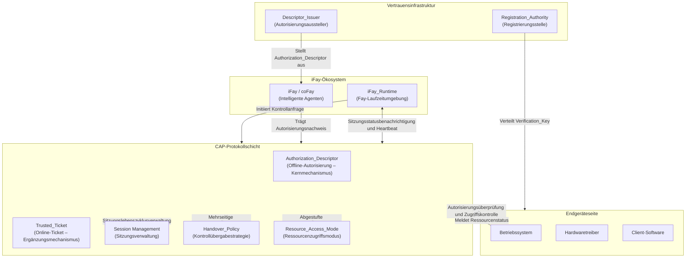

## Architekturübersicht

Das folgende Diagramm zeigt die Gesamtarchitekturposition des CAP-Protokolls im iFay-Ökosystem sowie die Interaktionsbeziehungen mit externen Systemen.

**Diagrammerläuterung:**

- **iFay-Ökosystem**: iFay/coFay (intelligente Agenten) interagieren über iFay_Runtime mit der CAP-Protokollschicht. iFay_Runtime ist dafür verantwortlich, stellvertretend für den Fay Kontrollanfragen zu initiieren und den für die Aktivitätserkennung erforderlichen Heartbeat-Kanal aufrechtzuerhalten
- **CAP-Protokollschicht**: Die Kernverarbeitungsschicht des Protokolls, die fünf Kernfähigkeiten umfasst – Authorization_Descriptor (Offline-Autorisierung), Trusted_Ticket (Online-Ticket), Session Management (Sitzungsverwaltung), Handover_Policy (Kontrollübergabestrategie) und Resource_Access_Mode (Ressourcenzugriffsmodus)
- **Endgeräteseite**: Umfasst Betriebssystem, Hardwaretreiber und Client-Software und ist die endgültige Ausführungsinstanz der Autorisierungsüberprüfungsergebnisse des CAP-Protokolls. Das Betriebssystem ist für die Durchführung der Ressourcenzugriffskontrolle und die Meldung des Ressourcenstatus an die Protokollschicht verantwortlich. Hardwaretreiber empfangen Kontrollanweisungen indirekt über das Betriebssystem
- **Vertrauensinfrastruktur**: Die Registration_Authority verteilt Verification_Keys an Endgeräte zur Unterstützung der Offline-Autorisierungsüberprüfung, und der Descriptor_Issuer stellt im Auftrag des Autorisierenden Authorization_Descriptors an Fays aus
