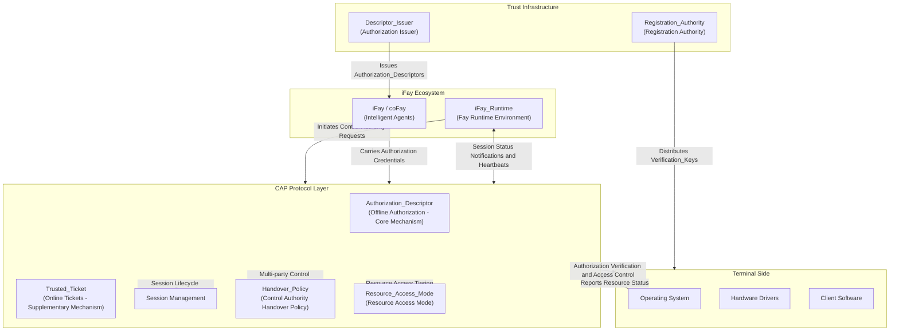

## Architecture Overview Diagram

The following diagram illustrates the overall architectural position of the CAP protocol within the iFay ecosystem and its interaction relationships with external systems.

**Diagram Description:**

- **iFay Ecosystem**: iFay/coFay (intelligent agents) interact with the CAP protocol layer through iFay_Runtime. iFay_Runtime is responsible for initiating control authority requests on behalf of Fays and maintaining the heartbeat channel required for liveness detection
- **CAP Protocol Layer**: The core processing layer of the protocol, containing five core capabilities — Authorization_Descriptor (offline authorization), Trusted_Ticket (online tickets), Session Management, Handover_Policy (control authority handover policy), and Resource_Access_Mode (resource access mode)
- **Terminal Side**: Includes the operating system, hardware drivers, and client software, serving as the ultimate executor of CAP protocol authorization verification results. The operating system is responsible for executing resource access control and reporting resource status to the protocol layer; hardware drivers receive control instructions indirectly through the operating system
- **Trust Infrastructure**: Registration_Authority distributes Verification_Keys to terminals to support offline authorization verification; Descriptor_Issuer, delegated by the authorizer, issues Authorization_Descriptors to Fays
