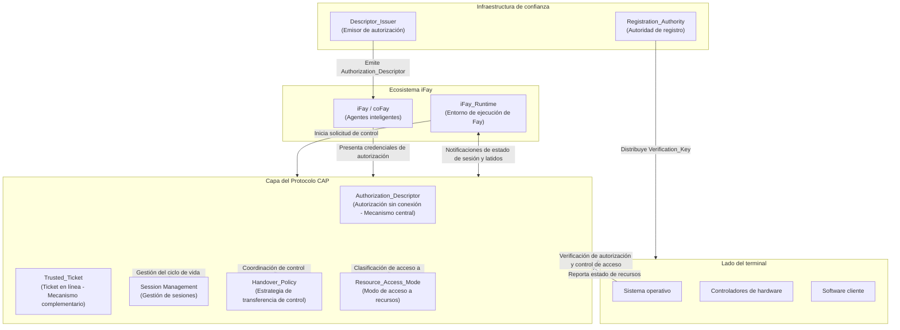

## Diagrama General de la Arquitectura

El siguiente diagrama muestra la posición general del protocolo CAP dentro del ecosistema iFay, así como las relaciones de interacción con los sistemas externos.

**Descripción del diagrama:**

- **Ecosistema iFay**: iFay/coFay (agentes inteligentes) interactúan con la capa del protocolo CAP a través de iFay_Runtime. iFay_Runtime es responsable de iniciar solicitudes de control en nombre del Fay y de mantener el canal de latidos necesario para la detección de actividad
- **Capa del protocolo CAP**: La capa de procesamiento central del protocolo, que contiene cinco capacidades centrales — Authorization_Descriptor (autorización sin conexión), Trusted_Ticket (ticket en línea), Session Management (gestión de sesiones), Handover_Policy (estrategia de transferencia de control) y Resource_Access_Mode (modo de acceso a recursos)
- **Lado del terminal**: Incluye el sistema operativo, los controladores de hardware y el software cliente, siendo el ejecutor final de los resultados de verificación de autorización del protocolo CAP. El sistema operativo es responsable de ejecutar el control de acceso a recursos y reportar el estado de los recursos a la capa del protocolo; los controladores de hardware reciben instrucciones de control indirectamente a través del sistema operativo
- **Infraestructura de confianza**: Registration_Authority distribuye Verification_Keys a los terminales para soportar la verificación de autorización sin conexión, y Descriptor_Issuer emite Authorization_Descriptors a los Fays por delegación del autorizante
