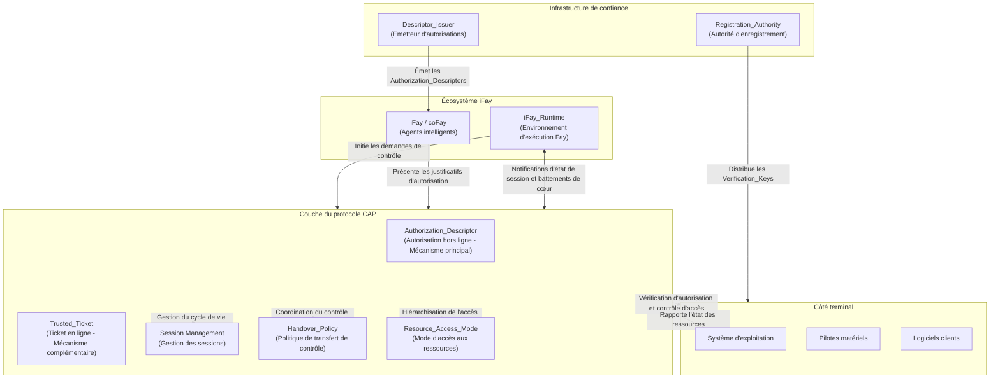

## Vue d'ensemble de l'architecture

Le diagramme suivant présente la position architecturale globale du protocole CAP dans l'écosystème iFay, ainsi que les relations d'interaction avec les systèmes externes.

**Légende du diagramme :**

- **Écosystème iFay** : iFay/coFay (agents intelligents) interagissent avec la couche du protocole CAP via iFay_Runtime. iFay_Runtime est responsable d'initier les demandes de contrôle au nom du Fay et de maintenir le canal de battements de cœur nécessaire à la détection de vivacité
- **Couche du protocole CAP** : Couche de traitement principale du protocole, comprenant cinq capacités principales — Authorization_Descriptor (autorisation hors ligne), Trusted_Ticket (ticket en ligne), Session Management (gestion des sessions), Handover_Policy (politique de transfert de contrôle) et Resource_Access_Mode (mode d'accès aux ressources)
- **Côté terminal** : Comprend le système d'exploitation, les pilotes matériels et les logiciels clients, constituant l'exécutant final des résultats de vérification d'autorisation du protocole CAP. Le système d'exploitation est responsable de l'exécution du contrôle d'accès aux ressources et du rapport de l'état des ressources à la couche du protocole, les pilotes matériels recevant indirectement les instructions de contrôle via le système d'exploitation
- **Infrastructure de confiance** : La Registration_Authority distribue les Verification_Keys aux terminaux pour soutenir la vérification d'autorisation hors ligne, le Descriptor_Issuer émet les Authorization_Descriptors aux Fays sur délégation de l'autorisant
