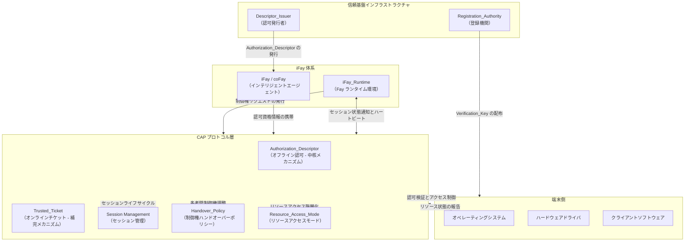

## アーキテクチャ概要図

以下の図は、CAP プロトコルの iFay 体系における全体的なアーキテクチャ上の位置づけ、および外部システムとの相互作用関係を示す。

**図の説明：**

- **iFay 体系**：iFay/coFay（インテリジェントエージェント）は iFay_Runtime を通じて CAP プロトコル層と相互作用する。iFay_Runtime は Fay を代理して制御権リクエストを発行し、生存検知に必要なハートビートチャネルを維持する
- **CAP プロトコル層**：プロトコルのコア処理層であり、5つのコア能力を含む——Authorization_Descriptor（オフライン認可）、Trusted_Ticket（オンラインチケット）、Session Management（セッション管理）、Handover_Policy（制御権ハンドオーバーポリシー）、Resource_Access_Mode（リソースアクセスモード）
- **端末側**：オペレーティングシステム、ハードウェアドライバ、クライアントソフトウェアを含み、CAP プロトコルの認可検証結果の最終的な実行者である。オペレーティングシステムはリソースアクセス制御の実行とプロトコル層へのリソース状態報告を担当し、ハードウェアドライバはオペレーティングシステムを通じて間接的に制御指令を受信する
- **信頼基盤インフラストラクチャ**：Registration_Authority は端末に Verification_Key を配布してオフライン認可検証を支え、Descriptor_Issuer は認可者の委任を受けて Fay に Authorization_Descriptor を発行する
