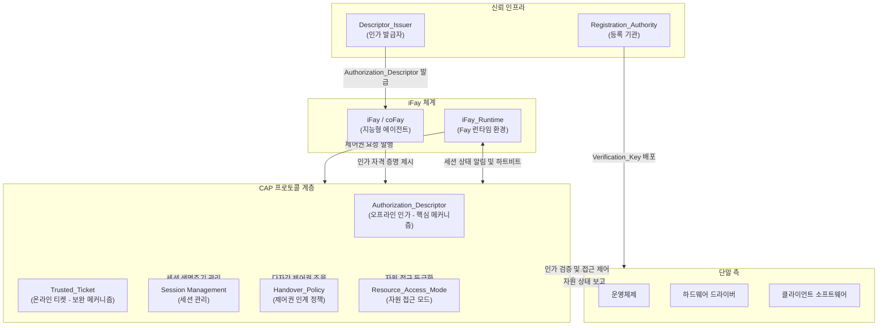

## 아키텍처 개요도

아래 그림은 CAP 프로토콜이 iFay 체계에서 차지하는 전체 아키텍처 위치와 외부 시스템 간의 상호작용 관계를 보여준다.

**그림 설명:**

- **iFay 체계**: iFay/coFay(지능형 에이전트)는 iFay_Runtime을 통해 CAP 프로토콜 계층과 상호작용한다. iFay_Runtime은 Fay를 대리하여 제어권 요청을 발행하고, 생존 감지에 필요한 하트비트 채널을 유지한다
- **CAP 프로토콜 계층**: 프로토콜의 핵심 처리 계층으로, 5가지 핵심 능력을 포함한다 — Authorization_Descriptor(오프라인 인가), Trusted_Ticket(온라인 티켓), Session Management(세션 관리), Handover_Policy(제어권 인계 정책) 및 Resource_Access_Mode(자원 접근 모드)
- **단말 측**: 운영체제, 하드웨어 드라이버 및 클라이언트 소프트웨어를 포함하며, CAP 프로토콜 인가 검증 결과의 최종 실행자이다. 운영체제는 자원 접근 제어를 실행하고 프로토콜 계층에 자원 상태를 보고하며, 하드웨어 드라이버는 운영체제를 통해 간접적으로 제어 지시를 수신한다
- **신뢰 인프라**: Registration_Authority는 단말에 Verification_Key를 배포하여 오프라인 인가 검증을 지원하고, Descriptor_Issuer는 인가자의 위임을 받아 Fay에게 Authorization_Descriptor를 발급한다
