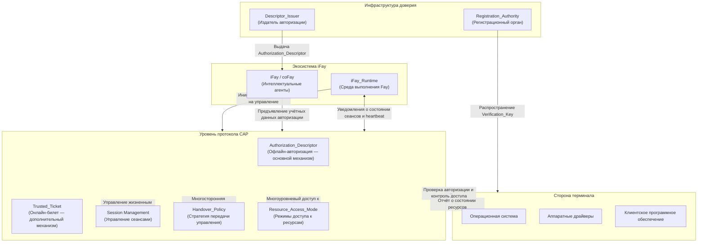

## Обзор архитектуры

На следующей диаграмме представлено общее положение протокола CAP в экосистеме iFay, а также взаимодействие с внешними системами.

**Пояснение к диаграмме:**

- **Экосистема iFay**: iFay/coFay (интеллектуальные агенты) взаимодействуют с уровнем протокола CAP через iFay_Runtime. iFay_Runtime отвечает за инициирование запросов на управление от имени Fay и поддержание канала heartbeat, необходимого для обнаружения активности
- **Уровень протокола CAP**: Основной уровень обработки протокола, включающий пять основных возможностей — Authorization_Descriptor (офлайн-авторизация), Trusted_Ticket (онлайн-билет), Session Management (управление сеансами), Handover_Policy (стратегия передачи управления) и Resource_Access_Mode (режимы доступа к ресурсам)
- **Сторона терминала**: Включает операционную систему, аппаратные драйверы и клиентское программное обеспечение; является конечным исполнителем результатов проверки авторизации протокола CAP. Операционная система отвечает за выполнение контроля доступа к ресурсам и отчёт о состоянии ресурсов уровню протокола; аппаратные драйверы получают управляющие инструкции опосредованно через операционную систему
- **Инфраструктура доверия**: Registration_Authority распространяет Verification_Key на терминалы для обеспечения офлайн-проверки авторизации; Descriptor_Issuer по поручению уполномоченного лица выдаёт Authorization_Descriptor для Fay
