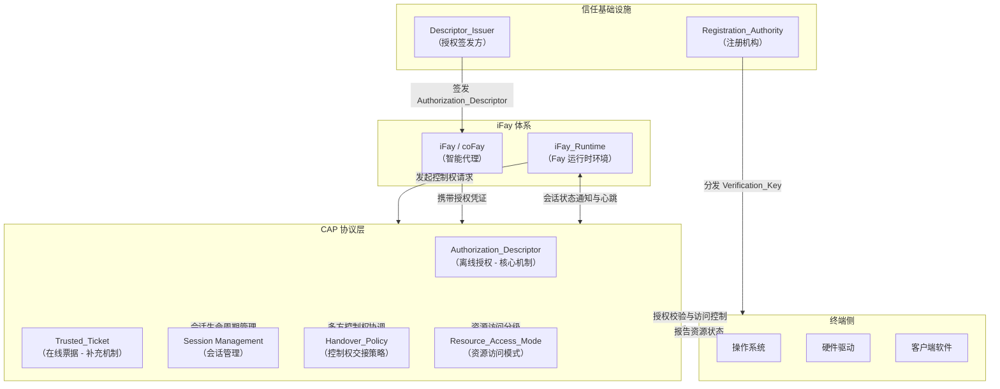

## 架构概览图

下图展示了 CAP 协议在 iFay 体系中的整体架构位置，以及与外部系统之间的交互关系。

**图示说明：**

- **iFay 体系**：iFay/coFay（智能代理）通过 iFay_Runtime 与 CAP 协议层交互。iFay_Runtime 负责代理 Fay 发起控制权请求，并维持存活检测所需的心跳通道
- **CAP 协议层**：协议的核心处理层，包含五项核心能力——Authorization_Descriptor（离线授权）、Trusted_Ticket（在线票据）、Session Management（会话管理）、Handover_Policy（控制权交接策略）和 Resource_Access_Mode（资源访问模式）
- **终端侧**：包括操作系统、硬件驱动和客户端软件，是 CAP 协议授权校验结果的最终执行方。操作系统负责执行资源访问控制并向协议层报告资源状态，硬件驱动通过操作系统间接接收控制指令
- **信任基础设施**：Registration_Authority 向终端分发 Verification_Key 以支撑离线授权校验，Descriptor_Issuer 受授权人委托向 Fay 签发 Authorization_Descriptor
