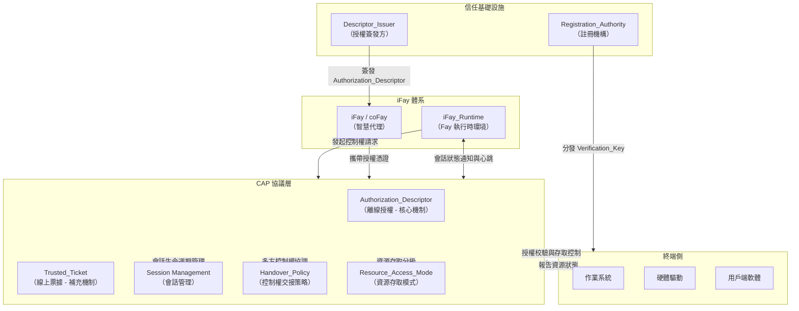

## 架構概覽圖

下圖展示了 CAP 協議在 iFay 體系中的整體架構位置，以及與外部系統之間的互動關係。

**圖示說明：**

- **iFay 體系**：iFay/coFay（智慧代理）透過 iFay_Runtime 與 CAP 協議層互動。iFay_Runtime 負責代理 Fay 發起控制權請求，並維持存活檢測所需的心跳通道
- **CAP 協議層**：協議的核心處理層，包含五項核心能力——Authorization_Descriptor（離線授權）、Trusted_Ticket（線上票據）、Session Management（會話管理）、Handover_Policy（控制權交接策略）和 Resource_Access_Mode（資源存取模式）
- **終端側**：包括作業系統、硬體驅動和用戶端軟體，是 CAP 協議授權校驗結果的最終執行方。作業系統負責執行資源存取控制並向協議層報告資源狀態，硬體驅動透過作業系統間接接收控制指令
- **信任基礎設施**：Registration_Authority 向終端分發 Verification_Key 以支撐離線授權校驗，Descriptor_Issuer 受授權人委託向 Fay 簽發 Authorization_Descriptor
